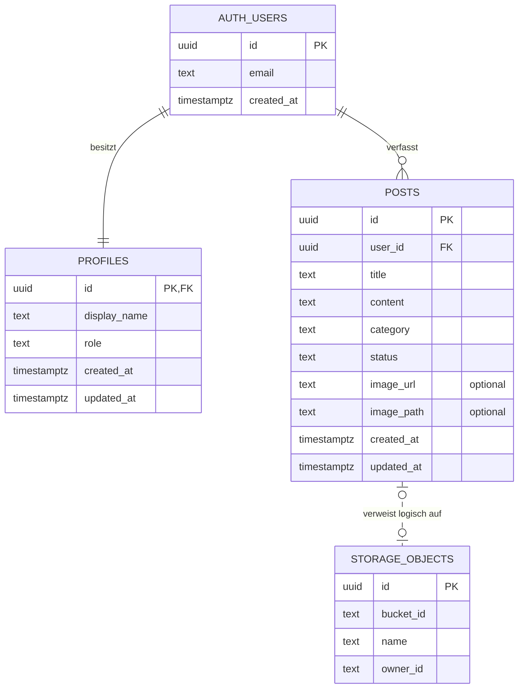

# Datenmodell

## Übersicht

Die Blogger App verwendet Supabase PostgreSQL. Supabase Auth verwaltet die Anmeldedaten in `auth.users`; die Anwendung ergänzt dazu ein öffentliches Profil in `public.profiles`. Jeder Benutzer kann mehrere Beiträge in `public.posts` besitzen.

Die gestrichelte Verbindung zu `storage.objects` ist keine Datenbank-Fremdschlüsselbeziehung. `posts.image_path` enthält lediglich den Objektpfad im Bucket `post-images`.

## Tabellen

### `auth.users`

Diese Tabelle wird vollständig von Supabase Auth verwaltet.

| Feld | Typ | Bedeutung |
| --- | --- | --- |
| `id` | `uuid` | Primärschlüssel und eindeutige Benutzer-ID |
| `email` | `text` | E-Mail-Adresse für die Anmeldung |
| `created_at` | `timestamptz` | Registrierungszeitpunkt |

Nach einer Registrierung erstellt der Trigger `on_auth_user_created` automatisch den zugehörigen Datensatz in `profiles`.

### `public.profiles`

| Feld | Typ | Regeln |
| --- | --- | --- |
| `id` | `uuid` | Primär- und Fremdschlüssel auf `auth.users.id` |
| `display_name` | `text` | Pflichtfeld, standardmäßig leer |
| `role` | `text` | Nur `user` oder `admin`, Standardwert `user` |
| `created_at` | `timestamptz` | Wird automatisch gesetzt |
| `updated_at` | `timestamptz` | Wird bei Änderungen automatisch aktualisiert |

Zwischen `auth.users` und `profiles` besteht eine 1:1-Beziehung. Wird ein Auth-Benutzer gelöscht, wird sein Profil durch `ON DELETE CASCADE` ebenfalls gelöscht.

### `public.posts`

| Feld | Typ | Regeln |
| --- | --- | --- |
| `id` | `uuid` | Primärschlüssel, automatisch generiert |
| `user_id` | `uuid` | Pflicht-Fremdschlüssel auf `auth.users.id` |
| `title` | `text` | 1 bis 160 Zeichen |
| `content` | `text` | Mindestens ein Zeichen |
| `category` | `text` | 1 bis 80 Zeichen |
| `status` | `text` | `draft`, `published` oder `disabled` |
| `image_url` | `text` | Optionale öffentliche URL zum Titelbild |
| `image_path` | `text` | Optionaler Objektpfad im Storage-Bucket |
| `created_at` | `timestamptz` | Wird automatisch gesetzt |
| `updated_at` | `timestamptz` | Wird bei Änderungen automatisch aktualisiert |

Zwischen `auth.users` und `posts` besteht eine 1:n-Beziehung. Ein Benutzer kann beliebig viele Beiträge verfassen, ein Beitrag gehört genau einem Benutzer. Beim Löschen des Benutzers werden seine Beiträge durch `ON DELETE CASCADE` mitgelöscht.

## Beitragsstatus

| Status | Bedeutung | Sichtbarkeit |
| --- | --- | --- |
| `draft` | Noch nicht veröffentlicht | Besitzer und Administratoren |
| `published` | Öffentlich freigegeben | Alle Besucher |
| `disabled` | Durch Moderation deaktiviert | Besitzer und Administratoren |

Normale Benutzer dürfen Beiträge als `draft` oder `published` speichern. Der Status `disabled` ist Administratoren vorbehalten.

## Indizes und Integrität

- `posts_user_id_idx` beschleunigt die Abfrage aller Beiträge eines Benutzers.
- `posts_public_idx` unterstützt die nach Datum sortierte Abfrage veröffentlichter Beiträge.
- Check-Constraints begrenzen Rollen, Statuswerte und Textlängen direkt in der Datenbank.
- Der Trigger `set_updated_at` pflegt die Änderungszeitpunkte von Profilen und Beiträgen.
- Row Level Security schützt Datensätze zusätzlich zum Routenschutz im Frontend.

Die ausführbare Definition des Modells befindet sich in [`supabase/schema.sql`](supabase/schema.sql).
